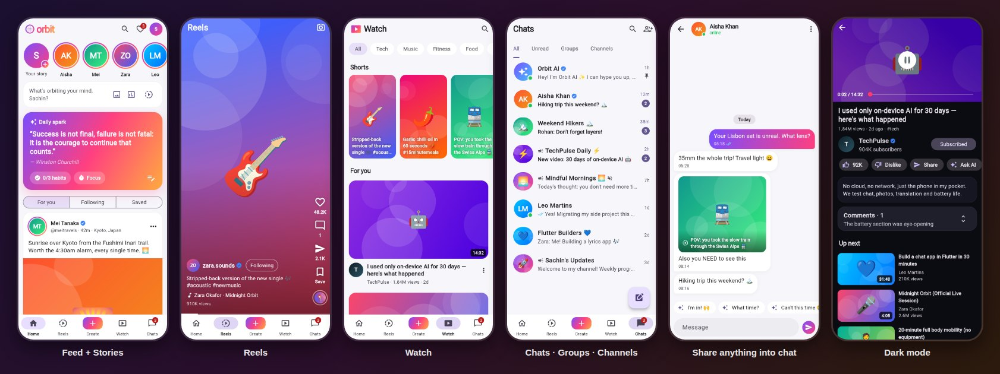

# 🪐 Orbit — every way to connect, in one app

**One trendy social super-app that blends the best interaction patterns of Facebook, Instagram, WhatsApp, Telegram and YouTube — plus an AI coach and mindful wellbeing tools.**

Built with Flutter. Evolved from *Daily Motivation AI*: the habits, focus timer and Grok-powered coach now live inside the social app.



## Why Orbit is different

Most people bounce between five apps to post, watch, message and broadcast. Orbit puts all of those into **one identity, one inbox and one composer**, and lets content move freely between them.

| Inspired by | In Orbit |
| --- | --- |
| **Facebook** | Feed with 6 reactions (long-press ❤️), comments, polls, shares, "What's on your mind" composer |
| **Instagram** | Stories with a gradient ring, double-tap to like, Reels, grid profiles, saved posts |
| **WhatsApp** | 1:1 and group chats, ✓ / ✓✓ / blue ✓✓ read receipts, typing indicators, reply-to, message reactions, pin & mute |
| **Telegram** | Broadcast **channels** with view counts, chat folders (All · Unread · Groups · Channels), channel discovery, bots in the chat list |
| **YouTube** | Watch tab with categories, Shorts shelf, player with scrubbing, subscribe, like/dislike, Watch later, Up next |

### What only Orbit does

- **✨ Omni-post** — write once, publish to your **Feed, Story, Reels and broadcast channel** in one tap, with generative "vibe" artwork, polls and a *Magic caption* button.
- **📤 Share anything anywhere** — any post, reel, video, story or profile can be sent to several chats at once, added to your story, broadcast to your channel, or handed off to WhatsApp / Telegram / Instagram / Facebook through the phone's share sheet.
- **💬 Story replies become conversations** — replying to a story opens a DM with the story attached, just like the best messengers.
- **🤖 Orbit AI in your chat list** — the Grok-powered coach is a pinned chat. Tap *Ask AI* on any video to get a summary in chat, and get smart reply chips in every conversation.
- **🌐 Your worlds** — link your Facebook, Instagram, WhatsApp, Telegram and YouTube handles on your profile. Friends tap to open you in the right app.
- **🌿 Mindful by design** — the feed ends with *"You're all caught up"*. Every day starts with a *Daily spark* quote, and the habits, focus timer and AI coach from Daily Motivation AI sit one tap away.
- **🔎 One search** across people, chats, channels, posts, reels and videos.
- 🌗 Light & dark themes, offline-first, with no network needed for the demo.

> Orbit never scrapes or proxies other networks. It interoperates only through public mechanisms: the OS share sheet and regular profile links.

## Tech stack

- Flutter 3.x / Dart 3.10+
- Riverpod (`StateNotifier`) for state
- SharedPreferences for local persistence (profile, linked worlds, habits, theme)
- `share_plus` + `url_launcher` for hand-off to other apps
- Grok / xAI API for the AI coach (simulated when no key is set)

```
lib/
  app/          theme, bottom-nav shell, cross-surface navigation
  data/         seed.dart — fictional demo people & content (swap for a backend)
  models/       Post, Story, Reel, Video, Chat/Message/SharedRef, OrbitUser, World
  providers/    feed, stories, reels, videos, chats, profile, habits, theme
  screens/      feed · stories · reels · watch · chats · create · profile · search · activity · wellbeing
  services/     grok_service.dart, external_share.dart
  widgets/      art canvas, avatars, reaction/comment/share sheets
```

All demo content is generated locally: people, posts and channels are fictional, and media is generative gradient art. Receipts, typing and replies in chats are simulated. Every screen reads from providers that depend only on the model classes, so connecting a real backend (Firebase, Supabase or your own API) is a data-layer change.

## Getting started

```bash
git clone https://github.com/sachin1024-92/daily-motivation-ai.git
cd daily-motivation-ai
flutter pub get
flutter run -d chrome        # the web target is included, so this works as-is
```

To build a static web version you can host anywhere (GitHub Pages, Netlify, Firebase Hosting):

```bash
flutter build web --release --no-web-resources-cdn   # output in build/web
```

`--no-web-resources-cdn` bundles the CanvasKit renderer with the app instead of loading it from Google's CDN.

Run the checks CI runs:

```bash
flutter analyze
flutter test
```

### Enable the live AI coach

Pass your xAI key at build time. Never commit it:

```bash
flutter run --dart-define=GROK_API_KEY=xai-your-key
```

Without a key, Orbit AI answers with built-in offline responses.

### Enable full CI builds (APK + AAB)

The repository ships the `web/` target (CI builds it on every run). To make the GitHub Actions workflow also build a release APK and App Bundle, add the mobile platform folders **once** on your machine:

```bash
cd daily-motivation-ai
flutter create . --platforms=android,ios
# Review the generated folders, then:
git add android ios .metadata
git commit -m "Add platform folders so CI can build APK/AAB"
git push
```

`flutter_local_notifications` requires core library desugaring on Android. If the APK build asks for it, enable `isCoreLibraryDesugaringEnabled = true` in `android/app/build.gradle.kts` and add the `desugar_jdk_libs` dependency, as described in that package's README.

After that, every push to `main` produces downloadable APK and AAB artifacts. `share_plus` needs Java 17 and a recent Android Gradle Plugin, which the current `flutter create` templates already use.

## Roadmap

- [x] Core screens & local state (quotes, habits, focus timer, AI chat)
- [x] GitHub Actions CI (analyze + tests)
- [x] Orbit: unified feed, stories, reels, watch, chats, groups, channels
- [x] Omni-post composer and share-to-anywhere
- [x] Linked worlds and OS share-sheet hand-off
- [x] Web target with Orbit icons and splash, built in CI
- [ ] Firebase Auth + Firestore realtime chats and feed
- [ ] Real photo/video capture and upload
- [ ] Live Grok streaming responses
- [ ] Push notifications (`flutter_local_notifications` is already a dependency)
- [ ] Play Store release (free + premium tiers)

## Why this project matters

Social apps are either feature silos or attention traps. Orbit tries to be both **complete** (everything you use daily, in one place) and **kind** (it tells you when you're done, and keeps your habits and AI coach close). It's built by someone who uses it daily while doing a Ph.D. and building side income.

## License

MIT

Built in public. Part of [@sachin1024-92](https://github.com/sachin1024-92) open source tools.
